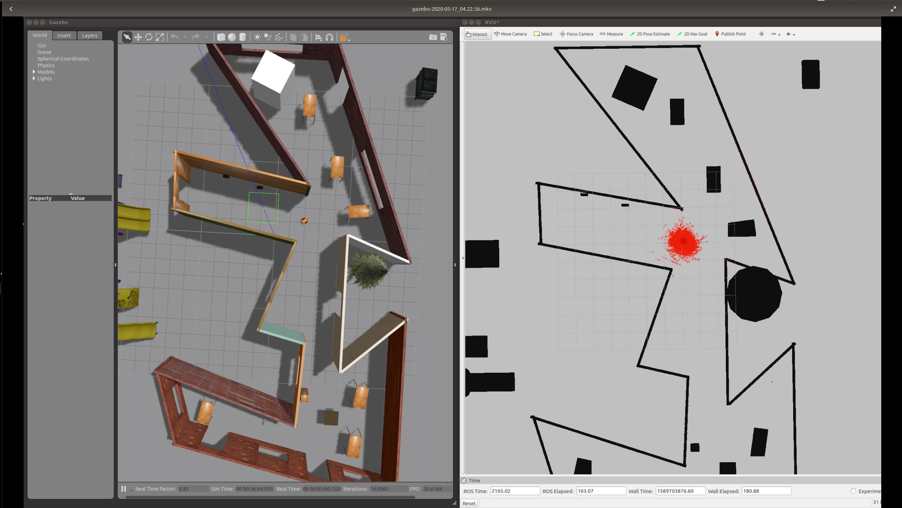

[](https://www.udacity.com/robotics)

# Udacity Nanodegree: Robotics Software Engineer

## Project 03: Where Am I

<p align="center">
    
</p>

### Directory Structure

```
.
├── docs
│   ├── AMCL_demo.png
│   ├── KT DOC.txt
│   └── nav_goal_and_teleop.mkv
├── LICENSE
├── my_ball
│   ├── model.config
│   └── model.sdf
├── README.md
└── src
    ├── ball_chaser
    │   ├── CMakeLists.txt
    │   ├── launch
    │   │   └── ball_chaser.launch
    │   ├── package.xml
    │   ├── src
    │   │   ├── drive_bot.cpp
    │   │   └── process_image.cpp
    │   └── srv
    │       └── DriveToTarget.srv
    ├── CMakeLists.txt -> /opt/ros/kinetic/share/catkin/cmake/toplevel.cmake
    ├── my_robot
    │   ├── CMakeLists.txt
    │   ├── config
    │   │   ├── base_local_planner_params.yaml
    │   │   ├── costmap_common_params.yaml
    │   │   ├── global_costmap_params.yaml
    │   │   ├── local_costmap_params.yaml
    │   │   └── __MACOSX
    │   ├── launch
    │   │   ├── amcl.launch
    │   │   ├── robot_description.launch
    │   │   └── world.launch
    │   ├── maps
    │   │   ├── my_map.pgm
    │   │   └── my_map.yaml
    │   ├── meshes
    │   │   └── hokuyo.dae
    │   ├── package.xml
    │   ├── urdf
    │   │   ├── my_robot.gazebo
    │   │   └── my_robot.xacro
    │   └── worlds
    │       ├── empty.world
    │       └── my_world.world
    ├── pgm_map_creator
    │   ├── CMakeLists.txt
    │   ├── launch
    │   │   └── request_publisher.launch
    │   ├── LICENSE
    │   ├── maps
    │   │   └── map.pgm
    │   ├── msgs
    │   │   ├── CMakeLists.txt
    │   │   └── collision_map_request.proto
    │   ├── package.xml
    │   ├── README.md
    │   ├── src
    │   │   ├── collision_map_creator.cc
    │   │   └── request_publisher.cc
    │   └── world
    │       ├── my_world.world
    │       └── udacity_mtv
    └── teleop_twist_keyboard
        ├── CHANGELOG.rst
        ├── CMakeLists.txt
        ├── package.xml
        ├── README.md
        └── teleop_twist_keyboard.py
```

### How to run

#### 1. First of all, clone this repo:
```
git clone git@github.com:Suraj0712/where_am_i.git
```

#### 2. Launch the robot inside your world
This lauuch file activates the Gazebo, Rviz, spawn the robot
This can be done by launching ```world.launch``` file:
```
$ cd <directory_where_you_have_cloned_the_repo>/where_am_i
$ catkin_make
$ source devel/setup.bash
$ roslaunch my_robot world.launch
```

#### 3. Launch amcl package
This lauuch file activates the move_base, amcl, and map server node
This can be done by launching ```amcl.launch``` file:
```
$ cd <directory_where_you_have_cloned_the_repo>/where_am_i
$ source devel/setup.bash
$ roslaunch my_robot amcl.launch
```

#### 4. Launch teleop package
This node is used for giving the control input to the robot
This can be launched by running ```teleop_twist_keyboard.py``` node:
```
$ rosrun teleop_twist_keyboard teleop_twist_keyboard.py
```

#### 5. Navigation goal
You can give the navigation goal to the robot from the ```RViz ``` by clicking on ```2D nav goal```


